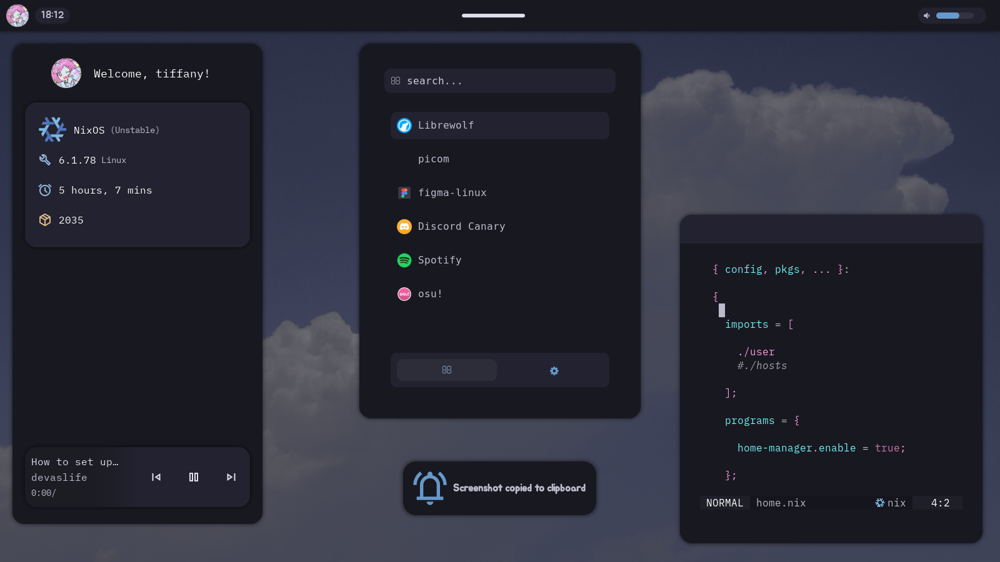

## Overview

 

This is my <code>old nix dotfiles</code> repo, which has some neat configurations!!

For now, i'll stop posting commits here because i want to focus on the making of my AwesomeWM configuration, as well as studies and overall taking care of myself.

### Features

* <code>Home-manager</code> modularized configurations;
* <code>Neovim</code> as a text editor;
* <code>Picom</code> to composite on X11 window managers;
* <code>Starship</code> as my shell's prompt;
* <code>Librewolf</code> as my browser (featuring custom css!);
* <code>Elkowar's wacky widgets</code> as a GTK shell.

## About Nix

As you may probably know, <code>Nix</code> and <code>NixOS</code> are mostly declarative (<code>Home-manager</code> included), that said it lets you reproduce your configuration on other hosts easily.
While you have those advantages, i wouldn't recommend getting into Nix because it really is time consuming. Feel free to go ahead and jumping into it, but expect something totally diffrent from other distributions.

While most pepole say it's a really long way to learn it, i think it mostly depends on you if you're learning it quick or not.
Speaking about home-manager, right below this is an example of how <code>flake.nix</code>'s modules are located(hopefully):

    ../home-manager/

    /hosts
      /freedom
        /configuration.nix
        ...
    ...

    /user
      /applications
        /window-managers
        /shell
        /variables
        ...
    /config
      /i3
        ...
      ...
    flake.nix
    home.nix
    ...
