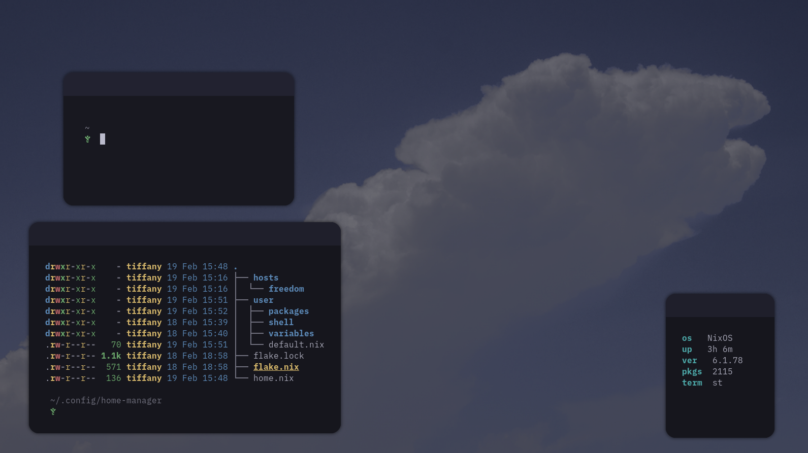

 

## Overview

This is my dotfiles repo, which ***soon*** will have some neat configurations for you to take some inspiration from :)

 

### Features

* <code>Home-manager</code> modularized configurations;
* <code>Neovim</code> as a text editor;
* <code>Picom</code> to composite on X11 windw managers;
* <code>Starship</code> as my shell's prompt;
* <code>Librewolf</code> as my browser (featuring custom css!);

## About Nix

hell yeah imdefinitively rewriting this

As you may probably know, <code>Nix</code> and <code>NixOS</code> are hot declarative mess (<code>Home-manager</code> included), that lets you infect other hosts with your messy code easily.

While you have those advantages, i wouldn't recommend getting into Nix because it really is time consuming. Feel free to go ahead and jumping into it, but expect something totally diffrent from other distributions.

Speaking about home-manager, right below this is an example of how <code>flake.nix</code>'s modules are located(hopefully):

    ../home-manager/

    /hosts
      /freedom
        /configuration.nix
        ...
    ...

    /user
      /applications
        /window-managers
        /shell
        /variables
        ...
    ...
